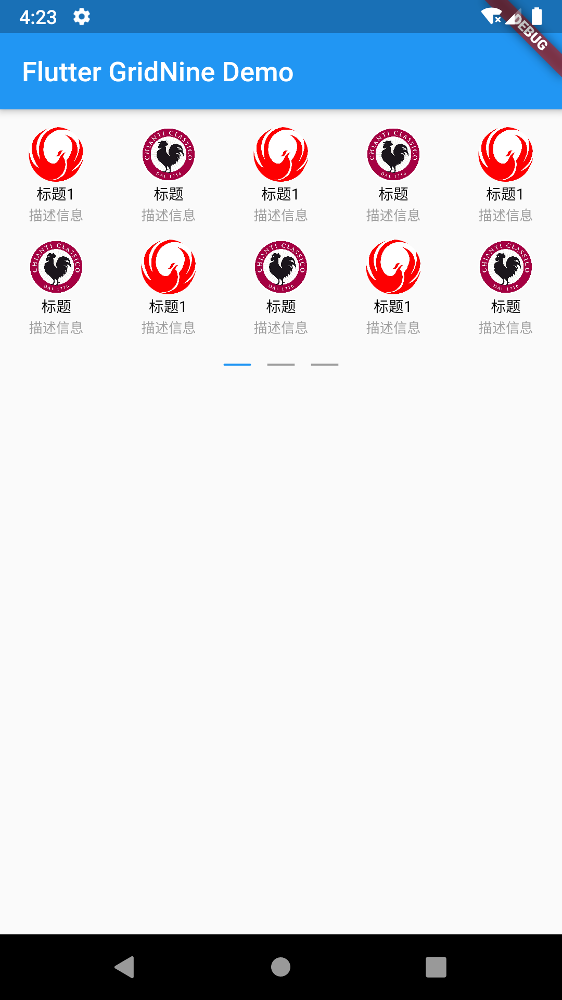

# flutter_gridnine

Flutter九宫格插件.

## Getting Started

### 引用
- pubspec.yaml:
```

```

- simpleModel.dart:
```
import 'package:flutter_gridnine/gridnine_model.dart';

class SimpleModel extends GNModel{
  final String url;
  final String iconUrl;
  final String title;
  final String description;

  SimpleModel({this.url,this.iconUrl,this.title,this.description});

  @override
  String getTitle() => title;

  @override
  String getIconUrl() => iconUrl;

  @override
  String getSubTitle() => description;

  @override
  String getUrl() => url;
}
```

- main.dart:
```
import 'package:flutter/material.dart';
import 'package:flutter_gridnine/flutter_gridnine.dart';

import 'simpleModel.dart';

void main() => runApp(MyApp());

class MyApp extends StatelessWidget {
  @override
  Widget build(BuildContext context) {
    return MaterialApp(
      title: 'Flutter Demo',
      theme: ThemeData(
        primarySwatch: Colors.blue,
      ),
      home: MyHomePage(title: 'Flutter Demo Home Page'),
    );
  }
}

class MyHomePage extends StatefulWidget {
  MyHomePage({Key key, this.title}) : super(key: key);
  final String title;

  @override
  _MyHomePageState createState() => _MyHomePageState();
}

class _MyHomePageState extends State<MyHomePage> {
  @override
  Widget build(BuildContext context) {
    var models = List<GNModel>();
    for (int i = 0; i < 16; i++) {
      models.add(
        SimpleModel(
            iconUrl:
                'https://timgsa.baidu.com/timg?image&quality=80&size=b9999_10000&sec=1567702065868&di=3b7a93083a7a10270c187ea395bf353a&imgtype=0&src=http%3A%2F%2Fpic32.nipic.com%2F20130808%2F13243996_132446704147_2.jpg',
            title: '标题1',
            description: '描述信息'),
      );
      models.add(
        SimpleModel(
            iconUrl:
                'https://timgsa.baidu.com/timg?image&quality=80&size=b9999_10000&sec=1567708302427&di=96653f7cdcd54169b9f296e6fe43b928&imgtype=0&src=http%3A%2F%2Fwww.suntop168.com%2Fblog%2Fzb_users%2Fupload%2F2014%2F2%2FE034CA83.jpg',
            title: '标题',
            description: '描述信息'),
      );
    }
    return Scaffold(
      appBar: AppBar(
        title: Text(widget.title),
      ),
      body: Container(
        margin: const EdgeInsets.only(top: 20),
        height: 210,
        child: GridNine(
          backgroundColor: Colors.white,
          collection: models,
          indicatorShow: true,
          indicatorActiveColor: Colors.blue,
          onTap: (GNModel item) {
            print(item.getTitle());
          },
        ),
      ),
    );
  }
}
```

# Preview

